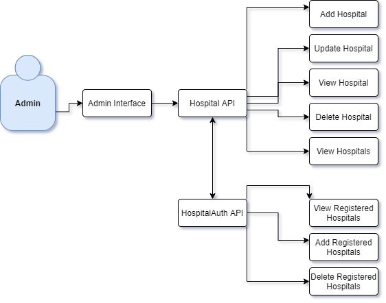
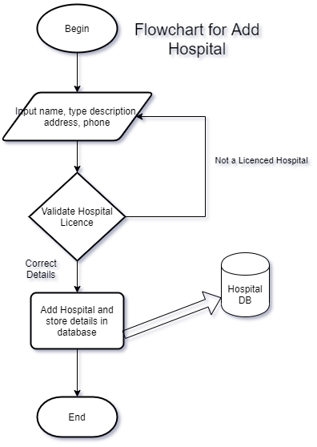
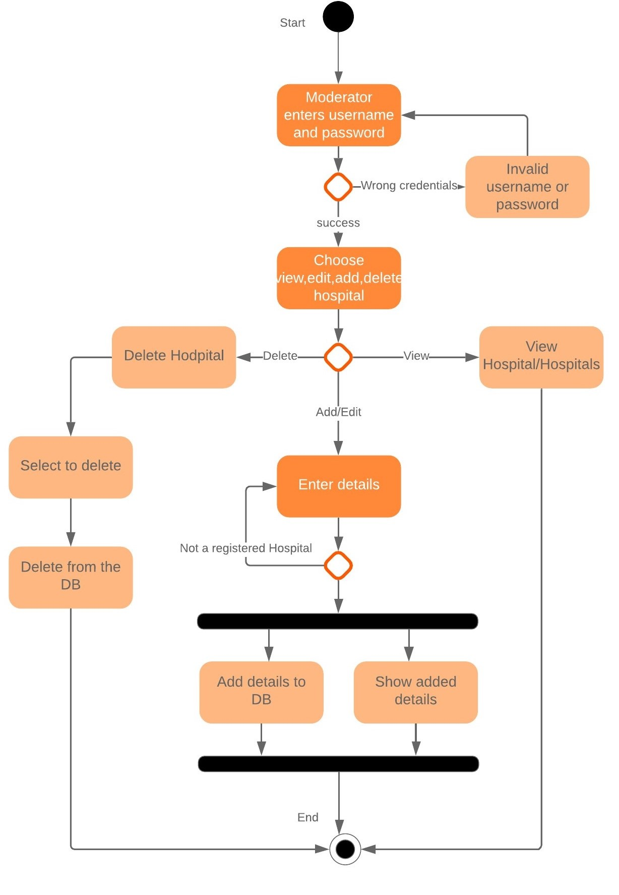
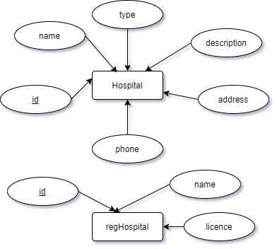

# Hospital Management

## API
Admin can access the interface and register hospitals through the Hospital API. Only authenticated hospitals given from the HospitalAuth API are allowed to be added into the system. Likewise, hospital or hospitals viewing, updating, and deletion can also be done using the Hospital API. 

## Flowchart for Add/Update Hospital function
The flowcharts represent the basic steps for register hospital into the system and update details by giving correct information into the system. 

## Class Diagram
Hospital model class has associations with both HospitalController and HospitalResource classes with respect to object creation. When API is called the relevant method in HospitalResource class is also called  which then navigates to HospitalController class to which perform the required actions using SQL queries and hospital objects while getting the DBConnection object to connect to the database. The HospitalAuth model is used to integrate with the HospitalAuth API. idGenerate class is used to generate unique id for each hospital  

## Activity Diagram
Hospital activity diagram will be representing the hospital adding functionality while checking if it validated with the authenticated hospital API before inserting the new hospital record.In addition the admin can  proceed to view the details, update specific details or even delete a hospital record. 

## ER Diagram
ER diagram will be representing the database table for hospital management function,  because a separate DB was used to handle the service. 

## Other relevant design diagrams - Use case diagram
This diagram is the representation of the Admin whose interaction with the system’s Hospital management API shows the relationship between the admin and the different use cases which involves adding new hospitals into the system, viewing details, updating details and deleting the record. 
